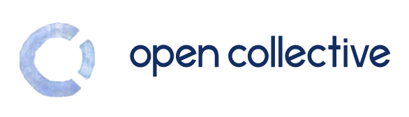

# OpenWorm updates August 2022

[**OpenCollective as a new funding stream**](#1-opencollective-as-a-new-funding-stream)

[**OpenWorm Studentships - first successful project completed**](#2-openworm-studentships---first-successful-project-completed)

[**NeuroPAL**](#3-neuropal)

[**Electrophysiological data from worm neurons**](#4-electrophysiological-data-from-worm-neurons)

[**DevoWorm updates**](#5-devoworm-updates)

[**OpenWorm simulation stack updates**](#6-openworm-simulation-stack-updates)

[**Other announcements**](#7-other-announcements)

## 1) OpenCollective as a new funding stream

We have added [OpenCollective](https://opencollective.com/openworm) as a new and easy way to donate to OpenWorm. Regular contributions to the project (monthly/yearly) are possible through this funding stream. See https://openworm.org/donate for more details.

One of the first uses of these funds will be to support **OpenWorm Studentships** (see below).

## 2) OpenWorm Studentships - first successful project completed

OpenWorm Studentships are a new way to incentivize contribution to the OpenWorm project, offering small stipends and recognition to junior researchers who want to spend time bringing their research into OpenWorm and making it more accessible for the wider community. See [here](https://openworm.org/studentships.html) for more information.

The first person to complete an OpenWorm Studentship project has been **Tyson Wheelwright**. He has made significant updates to the [Blender 2 NeuroML](https://github.com/openworm/Blender2NeuroML/) subproject.

<i>Figure showing images of a single cell (<a href="https://www.wormatlas.org/neurons/Individual%20Neurons/ADAframeset.html">ADAL</a>) taken from the original
<a href="https://github.com/openworm/Blender2NeuroML/blob/master/src/Data/Virtual_Worm_March_2011.blend">3D Blender file</a> on the left, and the corresponding image of the cell in
<a href="https://docs.neuroml.org/Userdocs/NeuroMLv2.html">NeuroML 2</a> format on the right. See
<a href="src/NeuroMLImages/README.md">here</a> for more examples.</i>

More Studentships will be offered to the community in late 2022.

## 3) NeuroPAL

<kbd></kbd>

<i>The above image shows the canonical positions and colors <a href="https://www.opensourcebrain.org/projects/neuropal/repository/revisions/main/show/NeuroML2?explorer=https%253A%252F%252Fraw.githubusercontent.com%252Fopenworm%252FNeuroPAL%252Fmain%252FNeuroML2%252FNeuroPAL_Canonical.net.nml">visualised on Open Source Brain</a>.</i>

https://github.com/openworm/NeuroPAL
More 3D data:

## 4) Electrophysiological data from worm neurons

https://github.com/openworm/WormsenseLab_ASH

## 5) DevoWorm updates

-> Bradly

## 6) OpenWorm simulation stack updates

Dockerfile

## 7) Other announcements

Poster at C elegans last year??
More...
